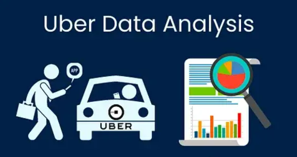

# Summary
Passionate developer, committed to crafting clean code and building innovative solutions.
Constantly learning and adapting in the ever-evolving world of technology.  #GitCommit😉

# My Projects

## Melanoma Detection using Convolutional Neural Networks
### Description
This project focuses on building a Convolutional Neural Network (CNN) to detect melanoma, a deadly form of skin cancer, from skin images. Melanoma accounts for a significant portion of skin cancer deaths, highlighting the importance of early detection. The dataset consists of images of various skin diseases, including melanoma, obtained from the International Skin Imaging Collaboration (ISIC).
 

 

The project includes features like:  

Custom CNN Model: The project uses a custom CNN model without using any pre-trained models or transfer learning.
Data Preprocessing: The images are resized to 180x180 pixels and normalized to rescale pixel values between 0 and 1.
Model Training: The model is trained for around 20 epochs on the original dataset and augmented dataset to improve performance.
Data Augmentation: Augmentation techniques are applied to resolve overfitting and underfitting issues.
Class Imbalance Handling: The project addresses class imbalances in the dataset using the Augmentor library.
Model Evaluation: The model's performance is evaluated after each training phase to analyze for overfitting, underfitting, and resolution of class imbalances.

[Link to Repo](https://github.com/LokeshwaranV/Melanoma-Detection-using-Convolutional-Neural-Networks)

 
 
 
 

## Neural Machine Translation (NMT) Model Building
### Description
The Neural Machine Translation (NMT) project focuses on building an attention-based sequence-to-sequence model to translate Spanish sentences into English. This project is motivated by the need for a US-based life insurance company to communicate effectively with the Spanish-speaking community in Mexico. By developing an NMT model, the company aims to provide seamless communication and coverage to this community.
 

 

The project includes features like:  

Attention Mechanism: The model utilizes attention mechanisms to understand the context of Spanish sentences and generate clear and coherent English translations.
Data Cleaning: Special attention is given to data cleaning tasks specific to the Spanish language, including handling special characters, to ensure accurate translation.
Encoder-Decoder Architecture: The model is based on the encoder-decoder architecture, where the encoder processes the input sentence in Spanish and the decoder generates the translated sentence in English.
Dataset: The project uses a paired corpus of English-Spanish data provided by Anki, ensuring a reliable dataset for training and evaluation.
Practical Application: The NMT model developed in this project has practical applications beyond the insurance industry, such as helping local traders do business with English-speaking merchants.
Educational Value: By working on this project, participants gain a deeper understanding of NMT models and attention mechanisms, enhancing their knowledge of natural language processing.

[Link to Repo](https://github.com/LokeshwaranV/Neural-Machine-Translation-Model)

 
 
 
 

## Data Science Project for Online Grocery Delivery Company
### Description
The project focuses on enhancing the data-driven strategies of an online grocery delivery company, "Everyday Deals," to increase sales, revenue, and customer engagement while reducing churn rate. It involves analyzing customer buying patterns and trends, building a customer churn model, and implementing data privacy and anonymization measures.
 

 

The project includes features like:  

Data Analysis: Understanding customer behavior through data analysis to improve product recommendations.
Churn Prediction: Building a model to predict customer churn and identifying factors influencing it.
Data Privacy: Implementing measures to protect customer information, such as data minimization and attribute masking.
Anonymization Techniques: Applying data anonymization techniques to ensure privacy while allowing for meaningful analysis.
Ethical Data Practices: Prioritizing data ethics to ensure responsible collection, storage, and use of customer data.

[Link to Repo](https://github.com/LokeshwaranV/NER-model-in-health-tech)

 
 
 
 

## NER model in health tech
### Description
The Health Tech NER project aims to develop a custom Named Entity Recognition (NER) model to extract disease names and their corresponding treatments from medical data. The project focuses on improving the efficiency of medical professionals by providing them with a tool to quickly identify and manage diseases and treatments in patient records.
 

 

The project includes features like:  

Custom NER Model: Utilizes a tailored NER model to accurately identify disease names and treatments from medical text.
Data Preprocessing: Converts tokenized data into coherent sentences for better analysis.
Concept Identification: Uses PoS tagging to identify common medical concepts, aiding in understanding and categorizing medical terms.
CRF Model Building: Constructs a Conditional Random Fields (CRF) model using sklearn for the NER application.
Performance Evaluation: Evaluates the model's performance using F1 score, ensuring accuracy and reliability.
User Interface: Provides a user-friendly interface for medical professionals to interact with the NER model, facilitating easy access to disease and treatment information.
Data-Driven Insights: Enables data-driven insights into disease prevalence, treatment effectiveness, and healthcare trends based on extracted data.
Enhanced Patient Care: Improves patient care by assisting doctors in making informed decisions about treatments and medical interventions.

[Link to Repo](https://github.com/LokeshwaranV/NER-model-in-health-tech)

 
 
 
 

## Finance and Risk Analytics
### Description
This project involves analyzing a portfolio of stocks for two investors, Mr. Patrick Jyenger and Mr. Peter Jyenger, to meet their financial goals. The dataset includes 24 stocks from leading companies listed on the NYSE, spanning from October 1, 2010, to September 30, 2020.
 

 

The project includes features like:  

Data Loading: Merging the dataset into a single dataframe with required columns.
Data Exploration: Creating interactive visualization dashboards and evaluating performance metrics to summarize stock performance.
Stock Analysis and Portfolio Management: Using investor information to create a profile and selecting a portfolio of stocks that have the potential to meet the financial goals of both investors.
Active Investment Strategy: Replicating past gains/returns over the future to predict the value of selected stocks and checking if the portfolio has the potential to fulfill the financial goals set by the investor.

[Link to Repo](https://github.com/LokeshwaranV/Finance-and-Risk-Analytics)

 
 
 
 

## Recipe Recommendation Engine
### Description
This project aims to build a recommendation engine for a recipe website, enhancing user engagement by providing personalized recipe recommendations. By leveraging machine learning algorithms like ALS and K Nearest Neighbors (KNN), the system will analyze user interactions with recipes to predict and suggest new recipes that users are likely to enjoy.
 

 

The project includes features like:  

Recommending recipes based on user preferences and past interactions.
Sub-sampling data to ensure real-time recommendation generation.
Using Spark platform for efficient model building and recommendation processing.
Optional implementation of KNN for hybrid recommender system.

[Link to Repo](https://github.com/LokeshwaranV/recommender-system)

 
 
 
 

## Click-Through Rate (CTR) Prediction for Online Advertising
### Description
This project focuses on predicting whether a user will click on an online ad, crucial for marketing decisions. It involves data preprocessing, model selection, evaluation, and risk assessment.
 

 

The project includes features like:  

Dataset: Contains 99,999 rows and 27 columns.
Objective: Predict ad click-through rates using 3 classification methods.
Techniques: Includes missing value treatment, categorical variable encoding, model evaluation using metrics like accuracy and AUC-ROC, and model improvement using cross-validation.

[Link to Repo](https://github.com/LokeshwaranV/Machine_Learning_Assignment)

 
 
 
 

## Parking Tickets Analysis_Using_Hive
### Description
This project aims to analyze parking ticket data from New York City to gain insights into parking violations. By applying Hive, a data warehousing tool, to a real-life dataset, we aim to understand the frequency of parking violations, the most common violation codes, and their occurrence times. Additionally, we will explore seasonality in parking violations to identify trends across different seasons. The project utilizes Apache Hive's functionality to process and analyze large datasets efficiently, providing valuable insights for urban planning and traffic management.
 

 

The project includes features like:  

Analyze parking ticket data from NYC Open Data portal
Identify total number of tickets issued and states to which cars belong
Determine frequency of parking violations across different times of the day
Find the most common violation codes and their corresponding times of day
Analyze seasonality in parking violations across different seasons

[Link to Repo](https://github.com/LokeshwaranV/Parking-Tickets-Analysis_Using_Hive)

 
 
 
 

## Uber Supply - Demand Gap Analysis
### Description
This project simulates real-world challenges faced by Uber, focusing on driver cancellations and car unavailability. Through data analysis and visualization, it aims to identify root causes and recommend solutions to improve operational efficiency. Key features include data cleaning, visualizing problem areas, analyzing the supply-demand gap, and providing actionable recommendations. Tools used include Python, Jupyter Notebook, and Tableau.
 

 

The project includes features like:  

Problem Identification: Utilizes EDA and visualization to identify issues like driver cancellations and car unavailability.
Data Cleaning: Addresses data quality issues and prepares the dataset for analysis.
Visualization: Uses plots to highlight problematic request types, time slots, and supply-demand gaps.
Recommendations: Provides actionable insights to improve operational efficiency.

[Link to Repo](https://github.com/LokeshwaranV/Uber_EDA)

 
 
 
 

## Understanding Data Structures and Algorithms in Python using departmental store data set
### Description
The Departmental Store Automation project is a Python-based solution designed to streamline operations in departmental stores. As a part of this assingment, I developed this project to automate tasks such as billing, inventory management, and sales analysis for departmental stores like Walmart and Amazon Fresh.
 

 

The project includes features like:  

Dynamic item management: Add or remove items from the store directory.  
Automated billing system: Calculate total costs for customer transactions, including taxes.  
Inventory management: Track the frequency of items purchased and manage stock levels.  
Sales insights: Identify top-selling items and apply discounts based on sales data.  

[Link to Repo](https://github.com/LokeshwaranV/Understanding-Data-Structures-and-Algorithms-in-Python-using-departmental-store-data-set)

 
 
 
 

## Bike sharing assignment
### Description
In this project, I tackled a complex data analysis assignment for Yulu, a popular bike-sharing startup based in India. The task involved providing data-backed insights to help the company scale up its user base and optimize internal operations.

 

Features:
SQL and Tableau Integration: Leveraged SQL for data manipulation and Tableau for visualizations.
Geographical Plotting: Mapped the locations of bike stations for better understanding.
Demand Prediction: Used data to predict demand and recommend station closures.
Operations Optimization: Provided strategies for optimizing bike availability and station operations.

[Link to Repo](https://github.com/LokeshwaranV/Bike-Sharing-Assignmnet)

